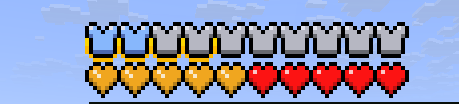

# DFH - Dahesor's Fake HUD

[中文](/readme/ZH_CN.MD)

DFH is a library that **draws player's HUD** (Health bar and Armor bar) **with actionbar**, and has the option to use a scoreboard based **virtual health** system **while still listening to vanilla hp inputs** (mob attacks, fall damage, effect heals, `/damage`, etc.).

Thus, data pack is allowed to modify player health with scoreboard commands and make arbitrty changes to vanilla signals before they take effects.



## Dependency

> [!IMPORTANT]
> To manage multiple text segments, the [Actionbar Mixer Library](https://github.com/Dahesor/Actionbar-Mixer-for-Minecraft) of version v1.3.2 or higher is required to use this library.
> Please [install Actionbar Mixer](https://github.com/Dahesor/Actionbar-Mixer-for-Minecraft/releases) first.

Although DFH uses actionbar to draw player HUD, powered by Actionbar Mixer you can still display any text with zero width along side DFH. See the documentation of Actionbar Mixer for details.

## Custom HUD Display

The player's health bar and armor bar is no longer drawn by the game, but by the data pack using Actionbar Mixer.

### Health bar and Absoprtion

#### Display

Player's score on `dfh.HP` will be rendered as hp with a scale of 100. So if a player has 2000 score on it, a full health of 20 will be drawn.

If score goes beyond 2000 then a second layer of yellow hearts will be drawn on top of the first one to represent hp higher than 20, followed by purple, green, and blue with a upper limit of 100 HP.

The HP bar flashes on damage or heal, and shakes on low health just like vanilla.

If the player is under poison or wither effect, then the top layer will become the corrsponding texture just like vanilla. By setting score `watch_mob_effect dfh.settings` 0 or 1 you can turn this effect off or on (Defaults to on).

Player's score on `dfh.Absorb` will be rendered as absorption values with a scale of 100. It can also render up to 4 layers for a max score of 8000 (80 points or 40 hearts).

Because different colors of hearts are already used for HP, the texture for absorption values have been changed to shields.

#### Driver

See the [Virtual Health Section](#virtual-health-system) to learn what could change player's scores on `dfh.HP` and `dfh.Absorb`. If Virtual Health system is off (`virtual_health dfh.settings` -> `0`) then DFH will only read these scores for hud rendering and will never change it (fully under your control).

### Armor Bar

#### Display

Player's score on `dfh.armor` will be rendered as armor points with a scale of 1. If it goes beyond 20 then a second layer of diamond colored armor icon will be rendered on top of the vanilla layer, up to a score of `40`.

Player's score on `dfh.toughness` will be rendered as golden frames (Kind of like the Apple Skin mod) around the vanilla armor bar to represent Armor toughness, up to a score of `20`.

This display **MAY NOT** re-draw automatically when there is a change in number. Run `function dfh:stats/armor` as the player to refresh it when you change its value.

#### Driver

If score `read_armor dfh.settings` is set to `1`, which is **on default**, then the DFH will automatically change the player's score on `dfh.armor` and `dfh.toughness` based on attributes when there is an equipment change.

When it does so, the armor bar is also refershed and no `function dfh:stats/armor` is needed. However if the player's attribute changed without an equipment change (for example, using the attribute command), then you must run `tag <Player> add dfh.update_armor` for DFH to update `<Player>`'s scores.

### Enchantment Protection Bar

#### Display

This bar is **off by default**. To turn it on, set score `ench_defence dfh.settings` to `1`.

This display player's score on `dfh.ench_defence` as a third bar on top of armor bar, to represent the total protection enchantment level the player have on armor slots, with a max score of `20`. Follows the same refresh rule as Armor Bar

#### Driver

`dfh.ench_defence` has **no driver on default**, so the DFH will not change its score. If set score `read_ench_defence dfh.settings` to `1`, then the DFH will automatically calculate the total protection levels and write to `dfh.ench_defence`, following the same refresh rule as the armor bar driver.

## Virtual Health System

The Virtual Health System is the default driver for `dfh.HP` and `dfh.Absorb` mentioned above. It is a scoreboard based **virtual health** system **while still listening to vanilla hp inputs**.

This system is **on by default**. To turn it off, set score `virtual_health dfh.settings` -> `0`.

> [!IMPORTANT]
> **If you do not plan on using this system, please create the `dfh.settings` dummy scoreboard and set the settings before installing the datapack so you have less trouble reseting player's attributes.**
>
> If not, you would have to reset the player's `max_health` and `max_absorption` attributes since DFH changes them for this system.

> [!CAUTION]
> The `freeze` damage sound effect is muted since DFH needs a way to deal damage silently. If you need the freeze damage sound, consider re-implement it with your own logic.

You may directly changes a player's scores on the following scoreboards to manage their health related logics:

* `dfh.HP`: Player's Current HP. Scale: 100 Default: 2000
* `dfh.MAX_HP`: Player's Max HP. Sclae: 100 Default: 2000
* `dfh.Absorb`: Player's Current Absoprtion Value. Scale: 100 Default: 0
* `dfh.Regen`: Player's Natural Regeneration cooldown. Unit: 0.1 ticks Defaults: 800 (vanllina cd).

> [!IMPORTANT]
> DFH does not kill the player if their `dfh.HP` drops below 0. You have to write your own logic. A normal `kill` command does work with DFH.

> [!IMPORTANT]
> Absoprtion Effect no longer works directly with DFH. If a player receives an absoprtion effect, either from command or golden apple, `dfh.Absorb` will not change accrodingly.
>
> You should write your own logic to increase a player's score on `dfh.Absorb` on these events. `dfh.Absorb` will still tank damage for the player like vanilla.

> [!IMPORTANT]
> Gamerule `natural_health_regeneration` is set to `false` since this logic is now managed by DFH.

> [!CAUTION]
> To reduce player's hunger, a custom enchantment is used. DFH will replace the player's saddle equipment slot with a temporary item with an enchantment to trigger the effect and remove the item, all done within one tick but not within function context. (If there is already an item, then DFH will apply enchantment to that item then remove the enchantment later).
>
> The temporary item has `custom_data` of `{dfh:{temp:1b}}` and the enchantment is `{"dfh:exhustion":1}` in case you need to deal with this logic.
>
> When DFH is operating player's inventory, the player will get tag `dfh.__inventory_changed` so your own `inventory_changed` advancement trigger could tell it is caused by DFH.

### Vanilla Signal Listeners

Although player's HP is now scoreboard based, DFH retains the ability to listen to Vanilla Health changes. If the player gets hurt or gets healed by any Vanilla method, their `dfh.HP` or `dfh.Absorb` will still changes just like vanilla, and you can even intercept these signals and change them before they take effect.

**#dfh:on_dmg**

`function #dfh:on_dmg` will be called as the player whenever the player got hurt, (by an entity, by mob effects,by environmental damage, ect.)

You may read or write the following scores on scoreboard `dfh.var`, when `#dfh:on_dmg` is called:
* `$dmg`: **(Read & Write)** The damage about to take. **Scale: 100**. Changing this to negative may cause undefined behaviour.

Additionally, the damage type causing this hurt will be stored in storage `dfh:var` under key `type`. Default namespace is included by default. (e.g. `minecraft:fall`)

> [!IMPORTANT]
> This damage type check only works for damage types exists in vanilla or DFH library. If a custom damage type is used the value in `type` will be `dfh:unknown`.
> However, you can add your own damage type to the checking list, see [Custom Damage Types](#custom-damage-types-identifying) Section

**#dfh:on_heal**

`function #dfh:on_heal` will be called as the player whenever the player got healed

Scores on scoreboard `dfh.var`:
* `$heal`: **(Read & Write)** The amount about to heal. **Scale: 100**.

**#dfh:on_regen_tick** and **#dfh:on_regen_success**

`function #dfh:on_regen_tick` will be called when there is a natural regeneration attempt (enough hunger and finished cooldown).

`function #dfh:on_regen_success` will be called when there is a natural regeneration attempt and the player's `dfh.HP` is less than `dfh.MAX_HP` so a regeneration actually happens.

Scores on scoreboard `dfh.var`:
* `$regen_amount`: **(Read & Write)** The amount about to heal. **Scale: 100**. Defaults to 100.
* `$reduce_hunger`: **(Read & Write)** If this is `1`, then the player will lose 1 Hunger or Saturation. Defaults to 1.

#### Custom Damage Types Identifying

On defualt, DFH only checks if a damage is one of the vanilla damage types. If it is a custom damage type created by you, then on the `#dfh:on_dmg` function call, the damage type information will be `dfh:unknown`.

To have it detect your own damage type, you need to:

1. Add your damage type to damage type tag `dfh:sys/all`.
2. Create an advancemnt like this:
```json
{
    "criteria": {
        "hurt": {
            "trigger": "entity_hurt_player",
            "conditions": {
                "damage": {
                    "type": {
                        "tags": [{"expected": true,"id": "damage tag"}]
                    }
                }
            }
        }
    },
    "rewards": {
        "function": "Your Function"
    },
    "parent": "dfh:root"
}
```
Make sure its `parent` is set to `dfh:root`. You can have additional conditions if you want, generally you Replace `damage tag` with a damage tag that contains your desired damage type. When triggers, execute `Your Function` which runs:
```mcfunction
function dfh:dmg_recieve {type:"ID"}
```
`ID` can be any string. Whenever this advancement triggers, on the `#dfh:on_dmg` call, `ID` will be provided by DFH as the damage type.

You do not have to revoke the advancemnt on trigger.

##### Overriding Vanilla Damage Type Triggers

<details>
<summary>How to make a custom entity_hurt_player trigger</summary>

If you need a custom `entity_hurt_player` advancement trigger to detect a sepcific event (for example, player took damage from a mob with a sepcific tag), you can disable DFH's sepcific `entity_hurt_player` trigger and use your own.

To stop DFH's trigger to work on a vanilla damage type, simply set score `<damage type id>` on scoreboard `dfh.disabled_trigger` to `1`. `<damage type id>` should include default name space.

For example, running `scoreboard players set minecraft:fall dfh.disabled_trigger 1` will stop DFH's trigger for `fall` damage from working.

Now if a player takes fall damage, in a `#dfh:on_dmg` call, the damage type will become `dfh:unknown`. However, you can create a custom advancement just like above to handle `fall` damage type. For example, you can create 2 advancement to split `fall` into 2 cases, running `function dfh:dmg_recieve {type:"normal_fall"}` and `function dfh:dmg_recieve {type:"special_fall"}`, and now when they triggers, `#dfh:on_dmg` will provided the damage type to be `normal_fall` or `special_fall`.

An uncaught case will result in `type` to become `dfh:unknown`.
</details>

### DFH Listeners

The following function tags will be called by DFH on specific events:

**#dfh:player_init**

Called when a player is first being initialized by DFH.

**#dfh:on_revive**

Called when a player revives.

**#dfh:on_hp_init_complete**

> [!CAUTION]
> When a player revives or joins the game for the first time, in the first 2 ticks the virtual health system is not useable for this player as DFH is setting up the player's HP.

Called when a DFH finished setting up a player so that the virtual health system starts working on them.

## DFH Functions

DFH provides some additional functions:

**dfh:redraw**

Immediately erase and redraw the entire hud for this player.

**dfh:stats/armor**

Immediately erase and redraw the armor bar for this player.

**dfh:kill**

Kill this Player with death message `❌ <Player Name>`

**dfh:fake_dmg**

Gives the player a 0.001 damage with no knockback. If you changed the player's score and wants to shake the player's screen then use this.

This will not send a damage event to `#dfh:on_dmg`.

**dfh:return**

Returns the numric version of DFH (>0).

**dfh:uninstall**

Uninstall the library. You should remove or disable the datapack before the next reload or DFH will load again.

> [!CAUTION]
> DFH's Virtual Health System changes the player's actual `max_health` and `max_absorption` attributs and it is impossible for an uninstall function to reset these for offline players
>
> Thus, DFH does not do this and you should be in charge of setting these 2 attributes back to normal.

## DFH Damage Types

DFH Provides the following damage types:
 - **dfh:silent**: Damage bypasses cooldown, invulnerability, without sound, and has no knockback
 - **dfh:sys**: Damage bypasses cooldown, invulnerability, and has no knockback
 - **dfh:sys_with_knockback**: Damage bypasses cooldown and invulnerability.

## Dependency File

A DFH-dependency.zip is provided with the release. Put this file anywhere on your computer, then by creating a `spyglass.json` file at the root of your workspace, the Spyglass extension will provides you the completion and error checking of all the functions, storages, and tags you need to write to use this library.

Example content of the `spyglass.json` file. See [Spyglass Documentation](https://spyglassmc.com/user/config.html) for more.
```json
{
	"env": {
		"dependencies": [
			"file:///C:/path/to/DFH-dependency.zip",
			"@vanilla-mcdoc",
			"@vanilla-resourcepack",
			"@vanilla-mcdoc"
		],
		"gameVersion": "1.21.11"
	}
}
```
Remeber to Reload Vs Code. If something about this somehow goes wrong, make Vs Code run the `Spyglass: Reset Project Cahce` command.
